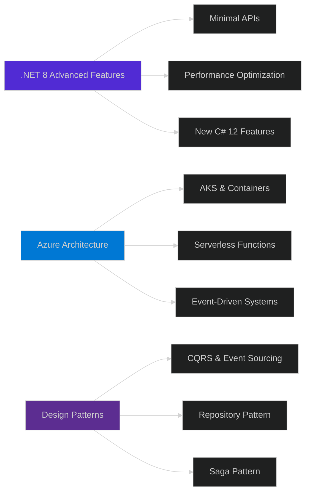

<!-- 
  ███╗   ██╗ ██████╗ ██╗   ██╗██████╗ ██╗  ██╗ █████╗ ███╗   ██╗    ██╗  ██╗██╗  ██╗ █████╗ ██╗     ███████╗██████╗ 
  ████╗  ██║██╔═══██╗██║   ██║██╔══██╗██║  ██║██╔══██╗████╗  ██║    ██║ ██╔╝██║  ██║██╔══██╗██║     ██╔════╝██╔══██╗
  ██╔██╗ ██║██║   ██║██║   ██║██████╔╝███████║███████║██╔██╗ ██║    █████╔╝ ███████║███████║██║     █████╗  ██║  ██║
  ██║╚██╗██║██║   ██║██║   ██║██╔══██╗██╔══██║██╔══██║██║╚██╗██║    ██╔═██╗ ██╔══██║██╔══██║██║     ██╔══╝  ██║  ██║
  ██║ ╚████║╚██████╔╝╚██████╔╝██║  ██║██║  ██║██║  ██║██║ ╚████║    ██║  ██╗██║  ██║██║  ██║███████╗███████╗██████╔╝
  ╚═╝  ╚═══╝ ╚═════╝  ╚═════╝ ╚═╝  ╚═╝╚═╝  ╚═╝╚═╝  ╚═╝╚═╝  ╚═══╝    ╚═╝  ╚═╝╚═╝  ╚═╝╚═╝  ╚═╝╚══════╝╚══════╝╚═════╝ 
-->

<div align="center">
  
  
  
</div>

<div align="center">
  
  <!-- Animated Typing Effect with Custom Styling -->
  
  
</div>

<br/>

<!-- Futuristic Divider -->


<br/>

<div align="center">

### 🎯 **TECH VISIONARY | CODE ARCHITECT | SYSTEM BUILDER**

</div>

<br/>

<!-- Main Content Grid -->
<table align="center">
<tr>
<td width="50%" valign="top">

### 🧬 **WHO AM I?**

```csharp
namespace Portfolio.Developer
{
    public sealed class NourhanKhaled : IBackendArchitect
    {
        // Core Identity
        public string FullName => "Nourhan Khaled";
        public string Location => "🇪🇬 Egypt";
        public string Motto => "Iron Heart, Code Soul";
        
        // Technical DNA
        public Stack<string> PrimaryStack => new()
        {
            "C# 12.0",
            ".NET 8.0",
            "ASP.NET Core",
            "Entity Framework Core",
            "SQL Server",
            "Azure Cloud"
        };
        
        // Passions & Expertise
        public Dictionary<string, string> Expertise => new()
        {
            ["Architecture"] = "Clean Architecture, DDD, CQRS",
            ["APIs"] = "RESTful, gRPC, GraphQL",
            ["Cloud"] = "Azure, Serverless, Microservices",
            ["Database"] = "SQL Server, Redis, Cosmos DB",
            ["DevOps"] = "Azure DevOps, GitHub Actions, Docker"
        };
        
        // Mission Statement
        public void Execute()
        {
            Console.WriteLine("🤖 I have an iron heart...");
            Console.WriteLine("   but I'm not Tony Stark!");
            Console.WriteLine();
            Console.WriteLine("💙 Powered by .NET");
            Console.WriteLine("⚡ Fueled by Microsoft Innovation");
            Console.WriteLine("🚀 Building the Future, One API at a Time");
        }
    }
}
```

</td>
<td width="50%" valign="top">

<div align="center">
  
  
  
  <br/><br/>
  
  <!-- 3D Contribution Snake -->
  
  
  <br/><br/>
  
  ### **📊 LIVE STATS**
  
  
  
  
  
</div>

</td>
</tr>
</table>

<br/>


<br/>

<!-- Tech Stack Section with Visual Hierarchy -->
<div align="center">

## 🛠️ **TECHNOLOGY ARSENAL**

<table>
<tr>
<td align="center" width="25%">

### **⚙️ CORE BACKEND**


</td>
<td align="center" width="25%">

### **☁️ MICROSOFT CLOUD**


</td>
<td align="center" width="25%">

### **🗄️ DATA LAYER**


</td>
<td align="center" width="25%">

### **🔧 DEV TOOLS**


</td>
</tr>
</table>

<br/>

### **💻 ADDITIONAL LANGUAGES & FRAMEWORKS**


### **🎨 CREATIVE TOOLS**


</div>

<br/>


<br/>

<!-- GitHub Statistics with Enhanced Visuals -->
<div align="center">

## 📈 **GITHUB ANALYTICS DASHBOARD**


<br/>

<table>
<tr>
<td width="50%">
  
</td>
<td width="50%">
  
</td>
</tr>
</table>

<br/>

<table>
<tr>
<td width="50%">
  
</td>
<td width="50%">
  
</td>
</tr>
</table>

<br/>

<!-- Activity Graph -->


<br/>

<!-- GitHub Trophies -->


</div>

<br/>


<br/>

<!-- Current Focus Section -->
<div align="center">

## 🎯 **CURRENT MISSION**

<table>
<tr>
<td width="33%" align="center">

### **🏗️ ARCHITECTURE**
Implementing **Clean Architecture**  
and **Domain-Driven Design**  
for enterprise applications

</td>
<td width="33%" align="center">

### **☁️ CLOUD NATIVE**
Building **microservices**  
with **Azure Kubernetes Service**  
and **Service Fabric**

</td>
<td width="33%" align="center">

### **⚡ PERFORMANCE**
Optimizing **API response times**  
with **caching strategies**  
and **async patterns**

</td>
</tr>
</table>

<br/>

### **📚 CONTINUOUS LEARNING**



</div>

<br/>


<br/>

<!-- Connect Section with Social Cards -->
<div align="center">

## 🌐 **CONNECT WITH ME**

<a href="https://www.linkedin.com/in/nourhan-khaled">
  
</a>
<a href="https://github.com/NourhanKhaled23">
  
</a>
<a href="mailto:knourhan208@gmail.com">
  
</a>
<a href="https://www.instagram.com/nourhan_khaled284">
  
</a>
<a href="https://www.facebook.com/nourhan-khaled">
  
</a>

<br/><br/>

<!-- Profile Views Counter with Custom Design -->


</div>

<br/>


<br/>

<!-- Inspirational Quote Section -->
<div align="center">

## 💭 **WORDS TO CODE BY**

<table>
<tr>
<td>

### 
> *"Any fool can write code that a computer can understand.  
> Good programmers write code that humans can understand."*  
> **— Martin Fowler**

### 
> *"The best way to predict the future is to implement it."*  
> **— David Heinemeier Hansson**

### 
> *"First, solve the problem. Then, write the code."*  
> **— John Johnson**

</td>
</tr>
</table>

</div>

<br/>

<!-- Support Section -->
<div align="center">

### **If you like my projects, don't forget to ⭐ star them!**

</div>

<br/>

<!-- Snake Contribution Animation -->
<div align="center">
  <picture>
    <source media="(prefers-color-scheme: dark)" srcset="https://raw.githubusercontent.com/NourhanKhaled23/NourhanKhaled23/output/github-contribution-grid-snake-dark.svg">
    <source media="(prefers-color-scheme: light)" srcset="https://raw.githubusercontent.com/NourhanKhaled23/NourhanKhaled23/output/github-contribution-grid-snake.svg">
    
  </picture>
</div>

<br/>

<!-- Footer with Wave Animation -->
<div align="center">
  
  
  
  <br/>
  
  **Made with 💙 by Nourhan Khaled**
  
  <sub>Powered by .NET | Crafted with C# | Deployed on Azure</sub>
  
</div>

<!-- Easter Egg ASCII Art -->
<!--
    ⠀⠀⠀⠀⠀⠀⠀⠀⠀⠀⠀⣀⣤⣶⣶⣶⣶⣦⣤⣀⠀⠀⠀⠀⠀⠀⠀⠀⠀⠀
    ⠀⠀⠀⠀⠀⠀⠀⠀⣠⣴⣿⣿⣿⣿⣿⣿⣿⣿⣿⣿⣿⣦⣄⠀⠀⠀⠀⠀⠀⠀
    ⠀⠀⠀⠀⠀⠀⢀⣾⣿⣿⣿⣿⣿⣿⣿⣿⣿⣿⣿⣿⣿⣿⣿⣷⡀⠀⠀⠀⠀⠀
    ⠀⠀⠀⠀⠀⠀⣾⣿⣿⣿⣿⣿⣿⣿⣿⣿⣿⣿⣿⣿⣿⣿⣿⣿⣷⠀⠀⠀⠀⠀
    ⠀⠀⠀⠀⠀⢸⣿⣿⣿⣿⣿⣿⣿⣿⣿⣿⣿⣿⣿⣿⣿⣿⣿⣿⣿⡇⠀⠀⠀⠀
    ⠀⠀⠀⠀⠀⢸⣿⣿⣿⣿⣿⣿⣿⠛⠛⠛⠛⣿⣿⣿⣿⣿⣿⣿⣿⡇⠀⠀⠀⠀
    ⠀⠀⠀⠀⠀⠘⣿⣿⣿⣿⣿⡿⠃⠀⠀⠀⠀⠘⢿⣿⣿⣿⣿⣿⣿⠃⠀⠀⠀⠀
    ⠀⠀⠀⠀⠀⠀⠈⠻⣿⣿⠟⠀⠀⠀⠀⠀⠀⠀⠀⠻⣿⣿⣿⠟⠁⠀⠀⠀⠀⠀
    ⠀⠀⠀⠀⠀⠀⠀⠀⠀⠀⠀⠀⢀⣀⣀⣀⡀⠀⠀⠀⠀⠀⠀⠀⠀⠀⠀⠀⠀⠀
    
    "The iron heart beats in binary, dreams in C#, and builds in .NET"
-->
